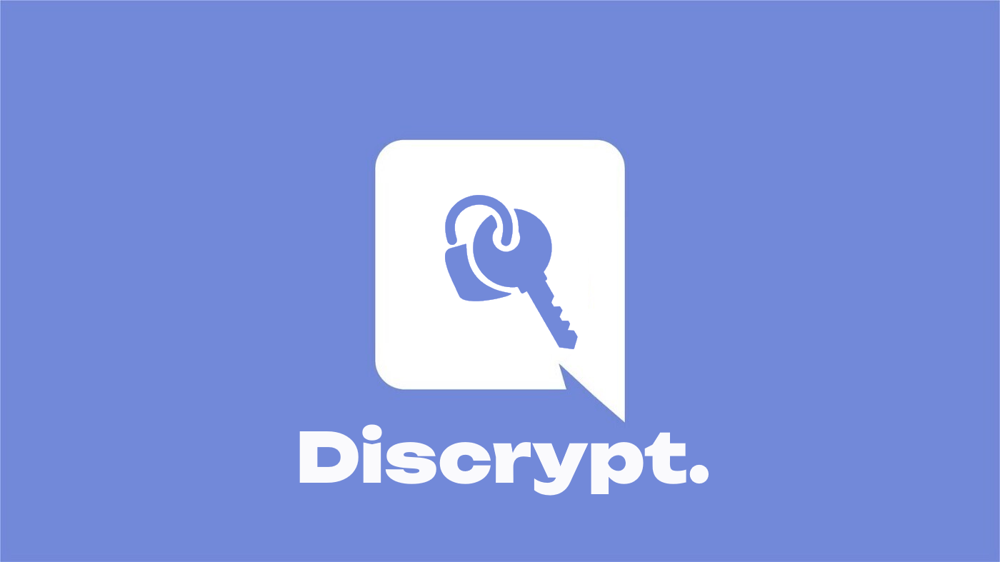

# Discrypt

What is Discrypt?
Discrypt is an open source, free as in "freedom" Better Discord Plugin which encrypts messages from Discord.
Discrypt uses RSA encryption, meaning that at no point anybody has to share any secret such as with symetrical passwords.

This will be my first JS project, feel free to improve code and to contribute!
